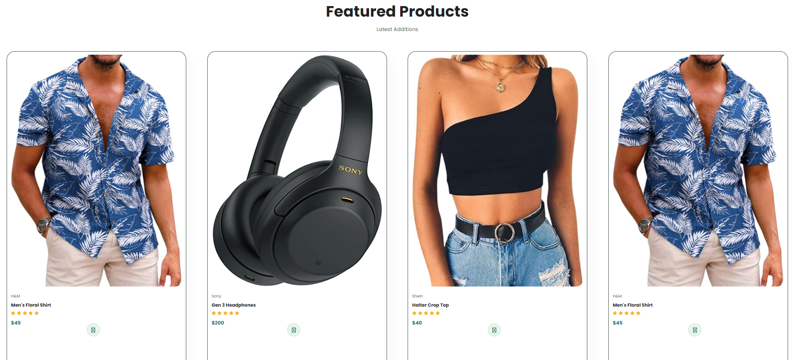

# Emptum Superstore
### Important Information:
CRN: 73378  
Group: 7  
Authors: 
Sehar Ahmed - 100808249 
Sterling Gallion - 100754018  
Kevin Jacob - 100784257  

### Contents:
[Description of project](https://github.com/Winter22SOFE2720/CRN-73378-Group-7-Project#description) 
[How to run](https://github.com/Winter22SOFE2720/CRN-73378-Group-7-Project#how-to-run) 
[Screenshots](https://github.com/Winter22SOFE2720/CRN-73378-Group-7-Project#screenshots) 
[Requirements](https://github.com/Winter22SOFE2720/CRN-73378-Group-7-Project/tree/main/Requirements#requirements) 
[Use Cases](https://github.com/Winter22SOFE2720/CRN-73378-Group-7-Project/tree/main/Use%20Cases#use-cases) 
[Design](https://github.com/Winter22SOFE2720/CRN-73378-Group-7-Project/tree/main/Design#design) 
[Code](https://github.com/Winter22SOFE2720/CRN-73378-Group-7-Project/tree/main/Code#code) 
[Test Case](https://github.com/Winter22SOFE2720/CRN-73378-Group-7-Project/tree/main/Test%20Case#test-cases) 

### Description:
Emptum Superstore is a web-based prototype of an online shopping store made by Sehar Ahmed, Sterling Gallion, and Kevin Jacob. Emptum Superstore strives to deliver a  customer first experience that provides the user with an easy and reliable website to use for their online shopping needs.

### How to run:
Visit https://winter22sofe2720.github.io/CRN-73378-Group-7-Project/Code/index.html to explore the website for yourself!

### Screenshots:
 
[Full image](https://github.com/Winter22SOFE2720/CRN-73378-Group-7-Project/blob/main/screenshots/landing_page.png)  
 
[Full image](https://github.com/Winter22SOFE2720/CRN-73378-Group-7-Project/blob/main/screenshots/featured_products.png)
