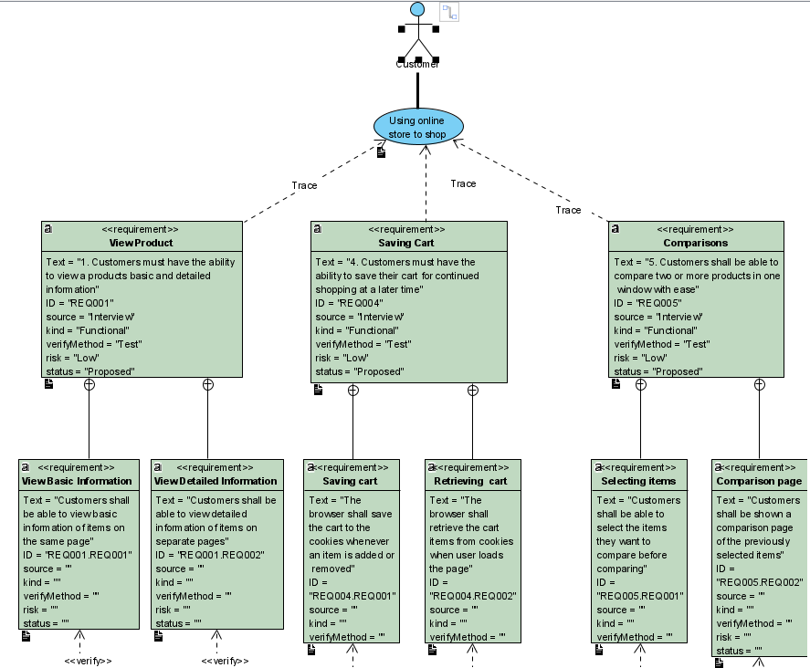

# Use Cases
There are two use cases for our online store
## Using Store
 
[Full image](https://github.com/Winter22SOFE2720/CRN-73378-Group-7-Project/blob/main/Use%20Cases/use_case_using_store.png)  
The first use case is the using store, it includes two actors: the customer, and the database that stores the products and cart information. This use case has three [requirements](https://github.com/Winter22SOFE2720/CRN-73378-Group-7-Project/tree/main/Requirements#requirements): view products, saving cart, and comparisons. This use case is meant to show how the customers will interact with the online store, and what will be necessary to accomplish that goal.
## Using Profiles
 
[Full image](https://github.com/Winter22SOFE2720/CRN-73378-Group-7-Project/blob/main/Use%20Cases/use_case_using_profiles.png)  
The second use case is the using profiles, it includes two actors: the customer, and the database that stores important profile information. This use case has two [requirements](https://github.com/Winter22SOFE2720/CRN-73378-Group-7-Project/tree/main/Requirements#requirements): user profiles, and logging in. This use case is meant to show how the customers will be able to create their personalized profiles, and use them on the store's website.
